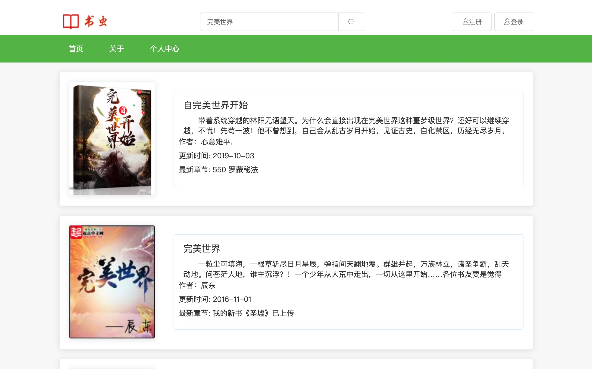
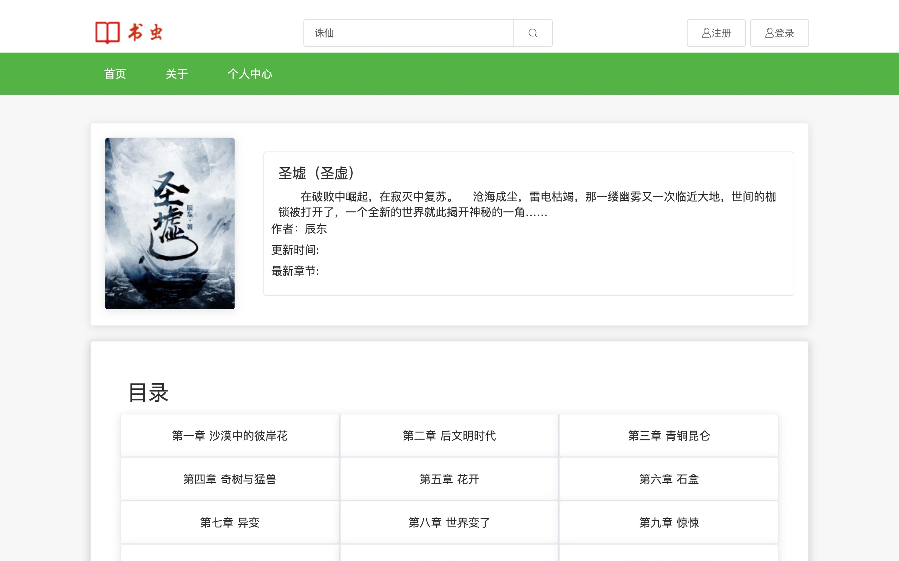
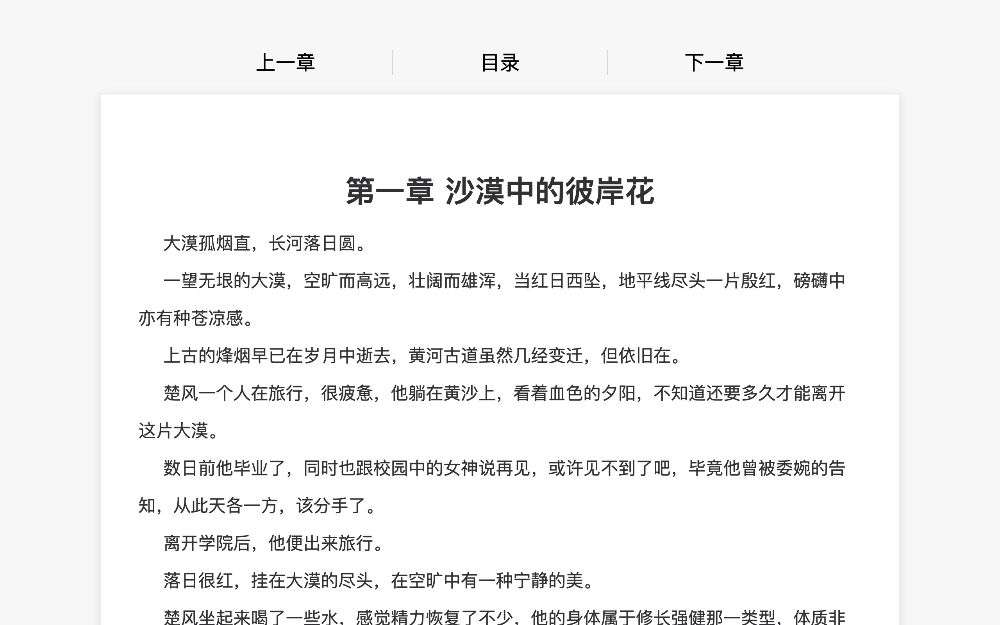

# 书虫小说
基于 `Vue` 实现的书虫小说前端。

## 截图

<h3>首页</h3>
<div align=center>
  
</div>

<h3>搜索</h3>
<div align=center>
  
</div>

<h3>目录</h3>
<div align=center>
  
</div>

<h3>阅读</h3>
<div align=center>
  
</div>

## 主要技术

- Vue.js
- vue-router 实现路由切换
- vuex 尝试使用状态管理
- axios 进行数据请求
- Less 编写样式
- localStorage 对几乎不会变动的数据做缓存，如小说章节内容，避免重复发起网络请求

## 实现功能

- 小说阅读
- 小说搜索
- 获取站外小说

## 项目结构


```
src
├─ api
│    └─ index.js 定义的api接口信息
├─ assets
│    ├─ fonts
│    └─ images
│           └─ favicon.png
├─ components
│    ├─ BaseButton.vue 
│    ├─ BaseFooter.vue
│    ├─ BaseHeader.vue
│    ├─ BaseNav.vue
│    ├─ BaseSearchBar.vue 顶部的搜索条组件
│    ├─ Carousel.vue 轮播图组件
│    ├─ Divider.vue 分割线组件
│    ├─ Pagination.vue
│    ├─ TagList.vue
│    └─ book
│           ├─ Item.vue 小说信息封装
│           └─ List.vue 小说列表
├─ main.js
├─ router.js
├─ store
│    ├─ book.js
│    └─ index.js
├─ styles
│    ├─ base.less 定义的一些公用属性
│    └─ mixins.less 定义的一些公用less函数
├─ utils
│    └─ index.js 定义了一些公有函数（包含防抖、节流处理）
└─ views
       ├─ About.vue 
       ├─ App.vue
       ├─ Chapter.vue 章节详情
       ├─ SearchResult.vue 搜索结果页
       └─ detail 小说目录详情
              ├─ BaseInfo.vue 
              ├─ Catalog.vue
              └─ index.vue

```

## 运行

``` bash

# install dependencies
npm install

# serve with hot reload at localhost:8080
npm run serve

# build for production with minification
npm run build
```

